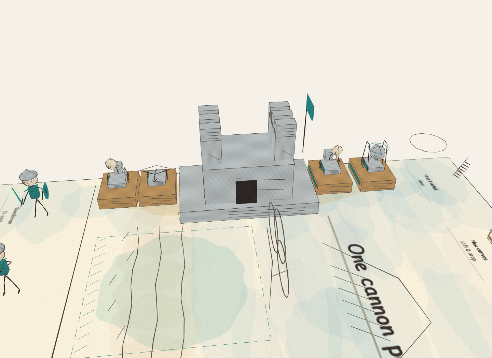

# Cannon foundations

The tabletop has four cannon positions per base, two on each flank. The engine
already starts with one unlocked slot and caps each side at four. Version 2.2.4
makes that existing rule visible: wood-wash foundations have a team-colored face
and an empty mounting ring. Unbuilt locations are broken pencil outlines.

Picking up a cannon highlights the next empty foundation. Picking up a dock
highlights the next unbuilt outline. From 2.2.5, moving the eraser over any of your
cannons highlights its dock. Releasing sells that cannon, refunding half its own
price and keeping the foundation for a replacement. Evolution also keeps
all purchased foundations. The enemy's foundations reflect its real slot count.

## Layout and input contract

`src/mr/defense-layout.js` owns positions, dimensions, target selection and landing
height. Rendering, release validation, throws and headless play use that shared
layout. Slot order alternates flanks: near rear, near front, far rear, far front.
Old saved games map their existing slots onto these positions. Selected sales use
the additive `{type:'sell',slot}` command; omitted slots keep their old meaning.
See [SDK compatibility](SDK.md) for reader requirements and legacy checkpoints.

`dock-model.js` draws the same foundation in the shop and on the book. Cannons
stand on its top surface, including while being drawn into the world. Broken
outlines are flat and have no fill. Gold corners mark the current target while
holding or throwing a relevant piece. Foundations and highlights use the existing
instance buffers and palette; they add no materials or textures.

Drop validation checks the expected slot using the current state at release.
Neither the base interior, an enemy dock, an occupied dock nor a locked outline
accepts a cannon. A second hand cannot reuse a just-filled target. Mouse/touch rays
project onto the raised surface, and hand/controller throws use segment-plane
intersection at that same height. A small horizontal tracking allowance remains
clear of the base and adjacent dock centers. Moving/scaling the book never changes
gameplay coordinates or cannon range.

The eraser selects the nearest physical dock at release, then checks occupancy.
An empty dock's tracking margin cannot select a different occupied neighbor.
Highlighting uses that same selection: mouse/touch input projects onto the actual
landing plane while its held preview floats above it. Hands and controllers use
their current grip positions. No cannon is sold until release; two erasers cannot
refund one cannon twice. The selected slot is stored in the replay command.

## Expansion checks

- `tests/cannon-docks.test.js` checks four purchases, misses without spending,
  simultaneous releases, sales, checkpoints, evolution and identical engine replays.
- Geometry checks inspect actual painted and shader-adjusted pencil vertices for
  all 18 defenses, both teams and resting/firing/preparing poses. Foundations stay
  separated and clear of all six bases; cannon feet meet their top surface.
- Browser tests build all four docks with real pointer drags and mount a cannon
  with emulated Quest controllers and hands. All six age screenshots include eight
  cannons on their foundations. Software rendering runs the same MR suite.
- `tests/selected-sale.test.js` verifies selection and exact refunds for every
  defense and team, invalid slots, repeated releases, old 2.2.4 checkpoints and
  new selected-sale replays. Browser checks replace older cannons through real
  mouse input, follow the highlighted dock, reload the save, and erase a selected
  older cannon with emulated hands and controllers.
- The full-army fixture includes four unlocked docks per side, 160 troops and
  eight firing cannons. Existing limits remain 250,000 triangles, 85 draw calls and
  30 textures per desktop view. Those counts do not establish physical Quest FPS.

On the hosted build, check reaching both flanks with hands and controllers,
highlight clarity, foundation contact, and a deliberate drop inside the base.
