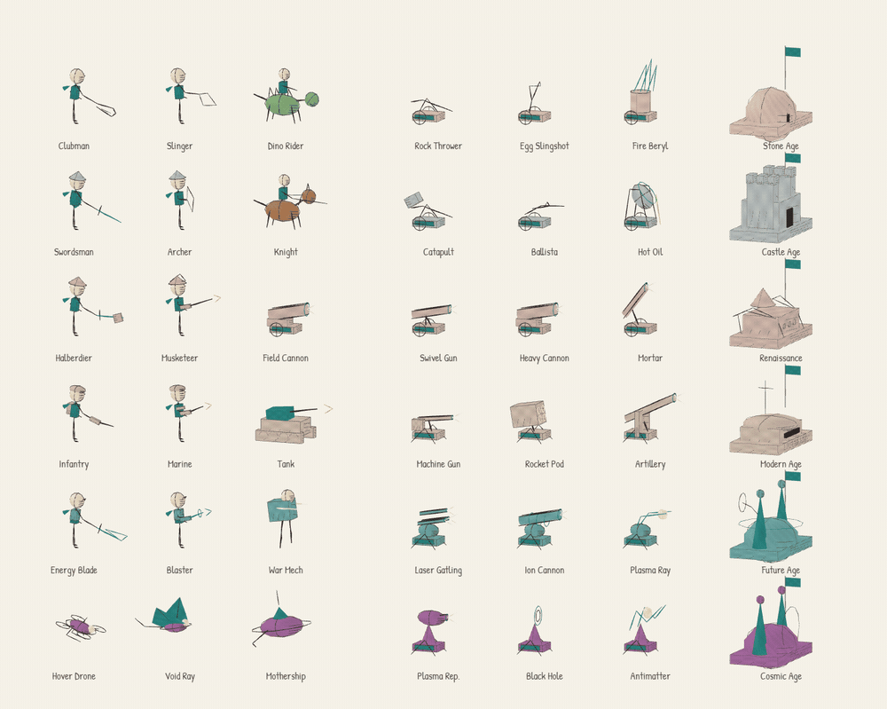

# Combat in the sketchbook

Version 2.2.3 animates every one of the 18 troops and 18 defenses. The watercolor,
spatial pencil strokes and team colors move together. Classic 2D drawing and the
authoritative game rules are unchanged.

This contact sheet is a renderer-only study with repeated firing. In an actual
battle, the engine decides every attack, target, projectile, hit and cooldown.

## Actions

| Pieces | Combat motion |
| --- | --- |
| Clubman, swordsman, halberdier, energy blade | Raised preparation, forward swing, braced feet, shoulder follow-through and recovery |
| Slinger, archer | Sling throw or bowstring draw and release; ammunition disappears on release |
| Dino rider, knight | Biting head / lowered lance, head follow-through and leg bracing |
| Musketeer, marine, blaster | Hand and shoulder recoil with a short drawn muzzle flash |
| Infantry | Rifle buttstroke matching its melee rules |
| Field cannon, tank | Barrel recoil; the tank turret rocks over its stable tracks |
| War mech | Torso compression and arm recoil |
| Hover drone, void ray, mothership | Forward bank, wing flex or charging crown, followed by recovery |
| Rock thrower, catapult | Pivoting lever and counterweight, released stone |
| Egg slingshot, ballista | Pouch/string pull and snap, released ammunition |
| Fire beryl, hot oil | Rising flame strokes or a tipping pot with a short pour |
| Swivel gun, heavy cannon, mortar, machine gun, artillery, plasma repeater | Barrel recoil against a stable support |
| Rocket pod | Tilting and recoiling housing, brief bright launch ports |
| Laser gatling, ion cannon, plasma ray | Rotating barrel cluster, charging coils or a contracting energy fork |
| Black hole, antimatter | Contracting and turning rings or opening/closing forks around a pulsing core |

## Timing contract

`combat-motion.js` samples `attackCooldown / attackSpeed` for troops and
`turretTimers / attackSpeed` for defenses. A fresh cooldown marks a real shot or
hit; recovery fades, then preparation leads into the next eligible attack.
Zero cooldowns and unfinished drawings produce a resting pose. Preparation can
settle when a target leaves range, but cannot invent another shot. Shop and held
pieces rest even when a battlefield piece of the same type is attacking.

Poses need no wall clock, random numbers, previous render frame, extra replay
fields or engine events. Skipped frames sample the current state directly.
Walking and airborne idle motion use the engine tick too: pause, checkpoint
restore and 1×/2×/3× speed all agree with combat. Decorative mist and held-item
presentation retain their separate clock. Comfort mode keeps the essential
strike/recoil while suppressing extra idle motion and muzzle strokes.

`InkBatch.pose(pivot, rotation, offset, draw)` applies a reusable local joint to
both contours and paint. Nested joints let shoulders carry arms and grips carry
weapons. Enemy rotations reflect correctly without negative instance scales.
The rig uses the existing instance buffers, not one mesh or skeleton per troop.

## Extend and verify

1. Add the form to `catalog.js` and its model to `infantry-model.js`,
   `troop-models.js` or `defense-models.js`. Keep the original silhouette at rest.
2. Use `strike`, `recoil`, `prepare` and `flash` from the sampled motion. Anchor
   limbs and weapons at shared grips/pivots; put fill and contour in the same joint.
3. Verify both teams, comfort mode, held pieces and a crowded battlefield.
   A changed geometry hash is necessary but does not establish good motion.
4. Run `npm run release:check`. The engine integration tests fire every type;
   geometry tests check all forms and mirrored paint; browser checks verify
   freeze/restore/speed and write release/recovery contact sheets.

`tests/fixtures/pencil-gallery.js` also exports `drawPencilGallery('armies', true)`,
`poseCombatGallery(seconds)`, `playCombatGallery()` and `stopCombatGallery()` for
scrubbing or playing the actual artwork when bundled in a local review page.
The normal static gallery remains unchanged. These are test-fixture APIs and
are not exposed by the published game.

The mixed-army fixture checks 160 troops and eight built defenses firing together
in all six ages, across release, recovery and preparation. Keep the existing
250,000-triangle and 85-draw-call limits; never raise them just to pass an art change.
The current maximum is 244,049 triangles and 77 draw calls per desktop view,
with 24 textures and no overflow. These are geometry measurements, not headset FPS.

After deployment, inspect the actions at small and large book sizes on Quest 3,
with hands and controllers and at each game speed. Confirm readability and comfort,
then save a headset timing report during a crowded fight.
