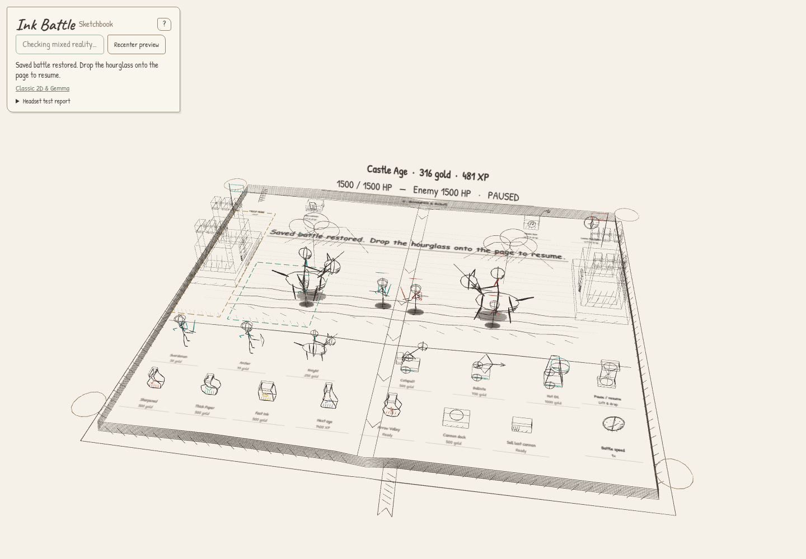
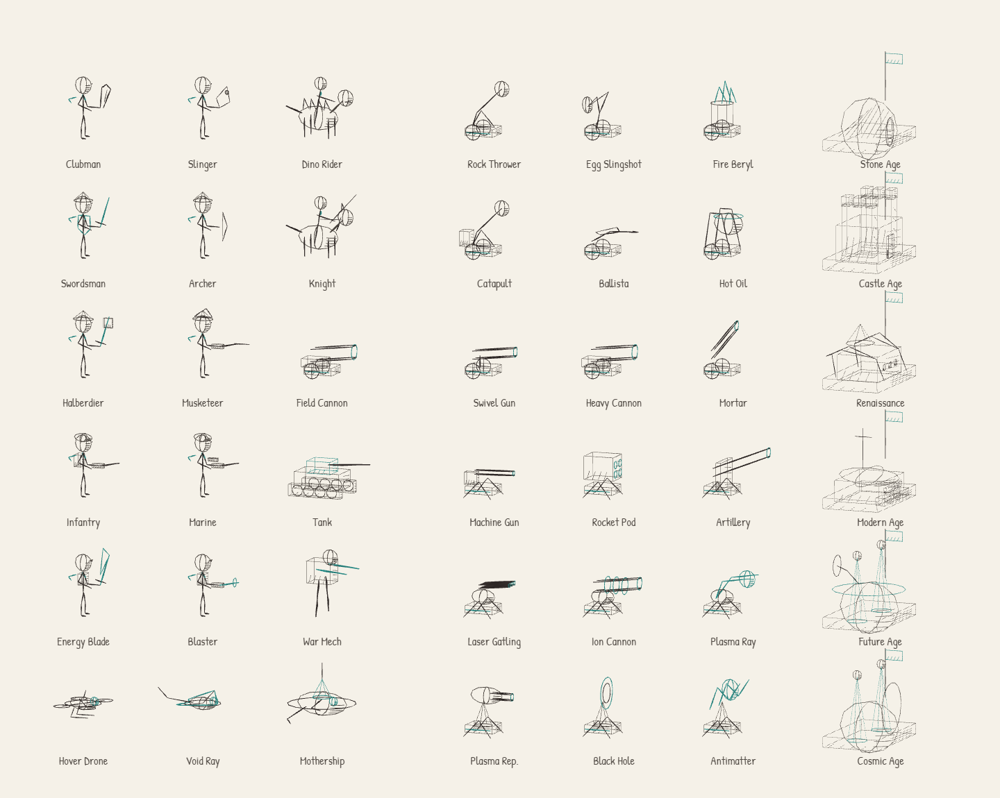
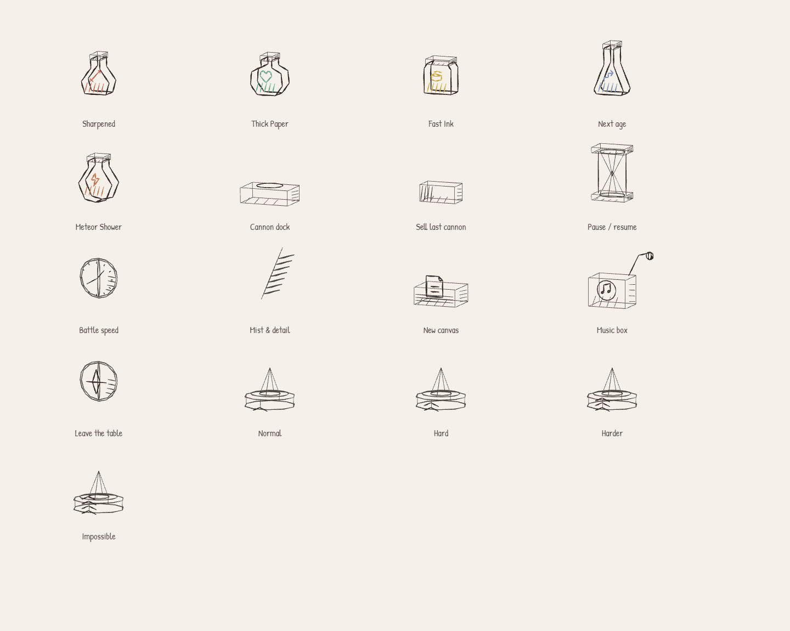

# The spatial pencil sketchbook

The MR client is a drawing that occupies space. It follows the open, expressive
3D marks shown in [Penzil](https://github.com/jacopocolo/Penzil), with original
Ink Battle artwork and rendering code. Penzil is a visual reference, not a runtime
dependency; none of its source or assets are bundled. The classic 2D client keeps
its original watercolor artwork.



The following contact sheets render the actual shipped drawings in fixed poses.





## Visual rules

- Draw the contour, then a few surface-following shade marks. Leave most of each
  surface unmarked. No solid body fills, textured mesh skins or triangle wireframes.
- Keep the paths in three dimensions. Turning or carrying the book reveals the
  other side of a soldier, wheel, bottle or building; these are not camera billboards.
- Graphite carries the silhouette. Teal/rust identifies sides, while a small pencil
  set reinforces potion glyphs. Color must never be the only identifying feature.
- Let strokes taper and vary slightly. Shape-local pressure is fixed: static art
  must not boil, shake randomly between frames, or change between stereo eyes.
- Preserve negative space, the combat lane, finger access and readable prices.
  Decorative scenery belongs behind the battle, clear of shop pickup targets.
- The book itself follows the same rules: layered page contours, cover edges,
  crease, sewn signatures, loose hatch shading and a forked ribbon bookmark.
  Its unmarked areas are transparent in MR. It has no invisible opaque paper fill.

## Catalog

| Chapter | Troop silhouettes | Defenses | Setting / base |
| --- | --- | --- | --- |
| First Marks | Club, sling pouch, plated dinosaur rider | Rock lever, forked egg sling, fire brazier | Ferns, volcano, fossil / bone cave |
| Banners & Bows | Sword and shield, drawn bow, horse and lance | Counterweight catapult, crossbow ballista, suspended oil pot | Oak and hills / crenellated keep |
| Powder & Sail | Halberd, tricorn and long musket, wheeled field gun | Swivel gun, heavy cannon, steep mortar | Windmill and navigation lines / star bastion |
| Iron & Static | Infantry pack, marine rifle sight, tracked tank | Belt gun, four-port rocket pod, shielded artillery | Wire and radio masts / sandbag bunker |
| Tomorrow in Pencil | Angular energy blade, ringed blaster, jointed mech | Three-barrel gatling, ion coils, plasma fork | Crystals and circuits / orbital laboratory |
| Margins of Space | Four-rotor drone, swept ray wings, crowned mothership | Plasma repeater, nested black-hole rings, antimatter forks | Planets and constellations / celestial gate |

Upgrade flasks have distinct profiles and sword, heart, coin, stair and lightning
symbols. The clock has hour marks; the compass has a needle; the music box has a
crank and note; the eraser has sleeve marks; seals carry one to four rank chevrons.
Specials draw falling meteors, arrows, cannonballs, an aircraft, an orbital shaft
or a jagged rift. Effects are presentation of engine state, never damage logic.

## Authoring and performance

`models.js` composes local-space lines, paths and reusable stroked volumes through
`InkBatch`. Add a distinctive silhouette there; use `glyphs.js` for a small item
symbol and `pencil-palette.js` for a semantic color. Do not add separate prices or
rules: shop offers still come from `AGES` through `catalog.js`.

`pencil-geometry.js` constructs thin, pressure-tapered triangular tubes along the
authored paths. Its primitives contain only contour and hatch paths. A small vertex
shader keeps the physical pencil width consistent when a primitive is stretched
into a wall or barrel. Width scales with the overall model and table. Geometry,
materials and instance buffers are reused across an army; there are no per-unit
textures, shaders, dynamic mesh allocations or postprocessing passes.

`sketchbook.js` owns chapter names, open-book contours and deterministic landscape
paths. Chapter scenery is built only when the age changes; replaced GPU resources
are disposed. Book geometry is static. Mist is a bounded set of pale drawn wisps,
not a filled fog plane. Contact shadows are short hatch strokes. Clear and comfort
modes retain their existing game controls.

The y=0 drop plane, pickup centers, deployment rules, table transforms and save
format are unchanged. A curled page edge is decoration below that plane, so it
cannot intercept or charge a thrown purchase.

## Verify an addition

```sh
npm run check
npx playwright test tests/browser/pencil-art.spec.js tests/browser/tabletop.spec.js --project=chromium
npm run test:tabletop
```

The art tests check stable, distinct drawings for every troop, defense, base,
special, potion and tool; actual open space through a stroked surface; and bounded
book/landscape geometry. The render suite produces army and shop contact sheets,
all six playable chapter screenshots, and full-army measurements. Inspect the
images in `test-results` or the CI release-evidence artifact. A different drawing
hash proves a difference in geometry, not artistic quality: visual inspection is
still required.

Existing gates remain below 85 draw calls and 250,000 triangles for the mixed
160-unit scene, with no instance overflow and no texture growth across ages.
Hand/controller grabbing, two-hand scaling, interruptions and offline saves remain
covered by the existing browser tests. Hardware readability and sustained frame
rate must be checked on Quest; desktop measurements are not headset results.

The 2026-09-24 revision passed 32 unit tests, 79 browser checks (15 intentional
platform skips), the 2,304-match release sweep, and the 192-match tabletop sweep.
All 13 pencil/tabletop browser checks also passed with Chromium software rendering.
